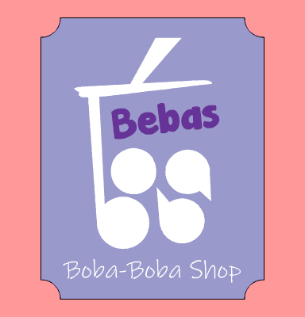
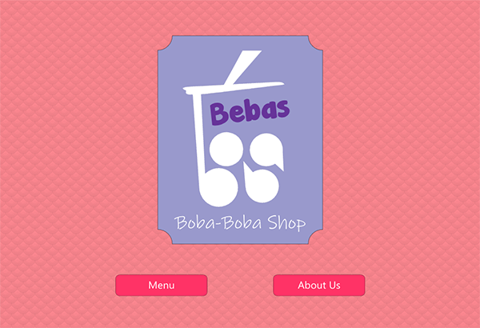
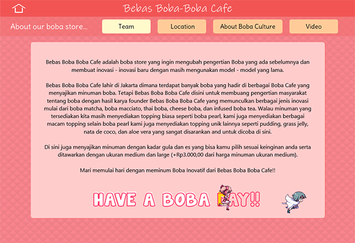
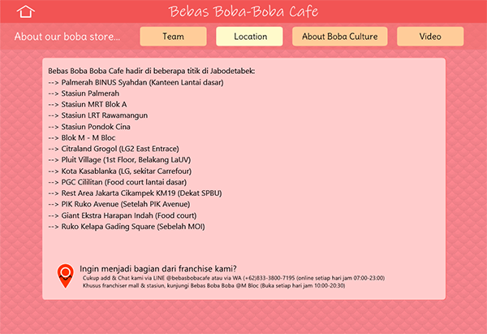
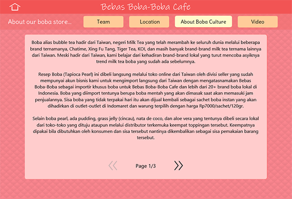
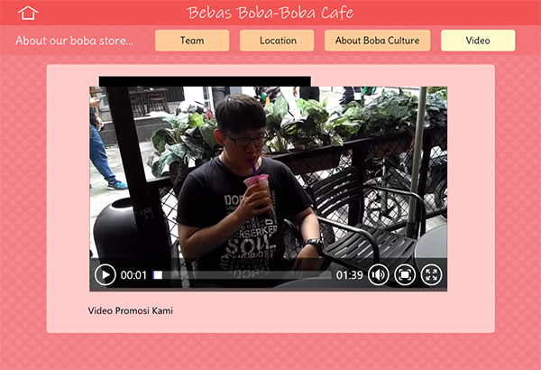
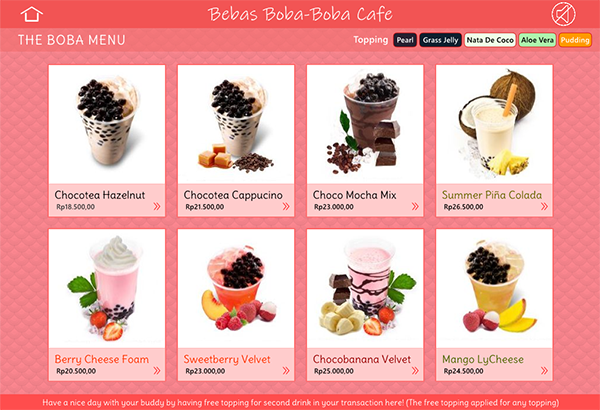
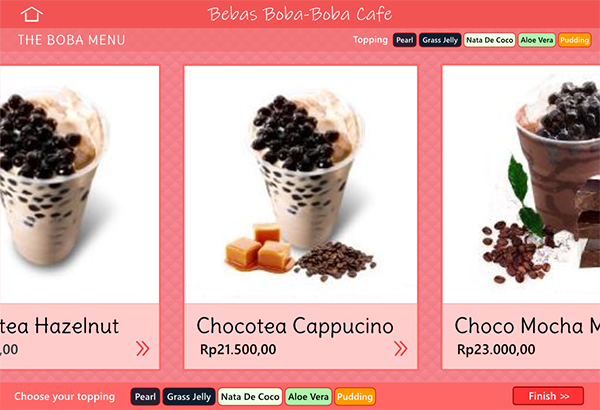
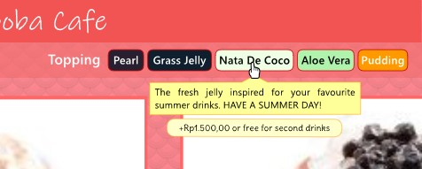

# Multimedia Project: IN BOBA (*Bebas Boba Boba Cafe*)

A Multimedia Lab Project in developing Boba drink interactive site using **Adobe Animate CC (HTML5 + JS)**.

## How to deploy/cara menjalankan project?

[Click here for interactive demo](https://akmalrusli363.github.io/Multimedia-Project-IN-BOBA/boba-home.html)

Jalankan dengan browser favorit kalian. Khusus bagi pengguna Chrome, jalankan dengan sistem hosting (bukan dari file langsung untuk mencegah bug) misal dengan menggunakan `localhost`.

## Isi Project

### Home

Berisikan logo dan 2 tombol menu untuk akses ke About Us dan Products

### About Us

Terdiri dari:
- Our Teams
- Location
- Our Boba Culture
- Video promosi produk (+Audio dibuat dengan software Vocaloid)

### Products

Terdiri dari 8 produk, yaitu:
- Chocotea Hazelnut
- Chocotea Cappucino
- Choco Mocha Mix
- Summer Pina Colada
- Berry Cheese Foam
- Sweetberry Velvet
- Chocobanana Velvet
- Mango LyCheese

Tentunya didemonstrasikan dengan cara pemesanan barang dan pemilihan produk serta diputarkan audio background dibelakangnya.

## Screenshot

### Home

### About

### Menu

## Dokumentasi dan Credit

</img>

Untuk dokumentasi dan credit, kunjungi file dokumentasi pada [link ini](./Dokumentasi%20Eksternal%20Bebas%20Boba%20Boba.docx) dan dokumentasi [CREDITS.md](CREDITS.md).

## Team Member
1. 2201730476 - Calvin Leonard King
2. 2201742160 - Christian Gabriel
3. 2201754721 - Akmal
4. 2201817483 - Akbar Asa Mulia
